# 🏗️ Architecture — Diamond Construction Website

> A full technical breakdown of the application's structure, data flow, rendering pipeline, component hierarchy, and deployment architecture.

---

## 📑 Table of Contents

1. [High-Level Architecture](#1-high-level-architecture)
2. [Application Boot Sequence](#2-application-boot-sequence)
3. [Routing Architecture](#3-routing-architecture)
4. [Component Tree](#4-component-tree)
5. [Home Page Section Flow](#5-home-page-section-flow)
6. [Loader Animation Sequence](#6-loader-animation-sequence)
7. [Navbar Smart-Hide Logic](#7-navbar-smart-hide-logic)
8. [FloatingQuote Panel State Machine](#8-floatingquote-panel-state-machine)
9. [HeroCarousel Logic](#9-hercarousel-logic)
10. [Testimonials Cycle Logic](#10-testimonials-cycle-logic)
11. [Data Flow — Static Props & Local Data](#11-data-flow--static-props--local-data)
12. [Asset Pipeline & Build Flow](#12-asset-pipeline--build-flow)
13. [Deployment Pipeline (GitHub Pages)](#13-deployment-pipeline-github-pages)
14. [Design Token System](#14-design-token-system)
15. [Animation Architecture](#15-animation-architecture)
16. [Responsive Breakpoint Strategy](#16-responsive-breakpoint-strategy)
17. [File Dependency Graph](#17-file-dependency-graph)

---

## 1. High-Level Architecture

The application is a **React 19 Single-Page Application (SPA)** with client-side routing. There is no backend — all data is static (hardcoded in components) and all routing happens in the browser.

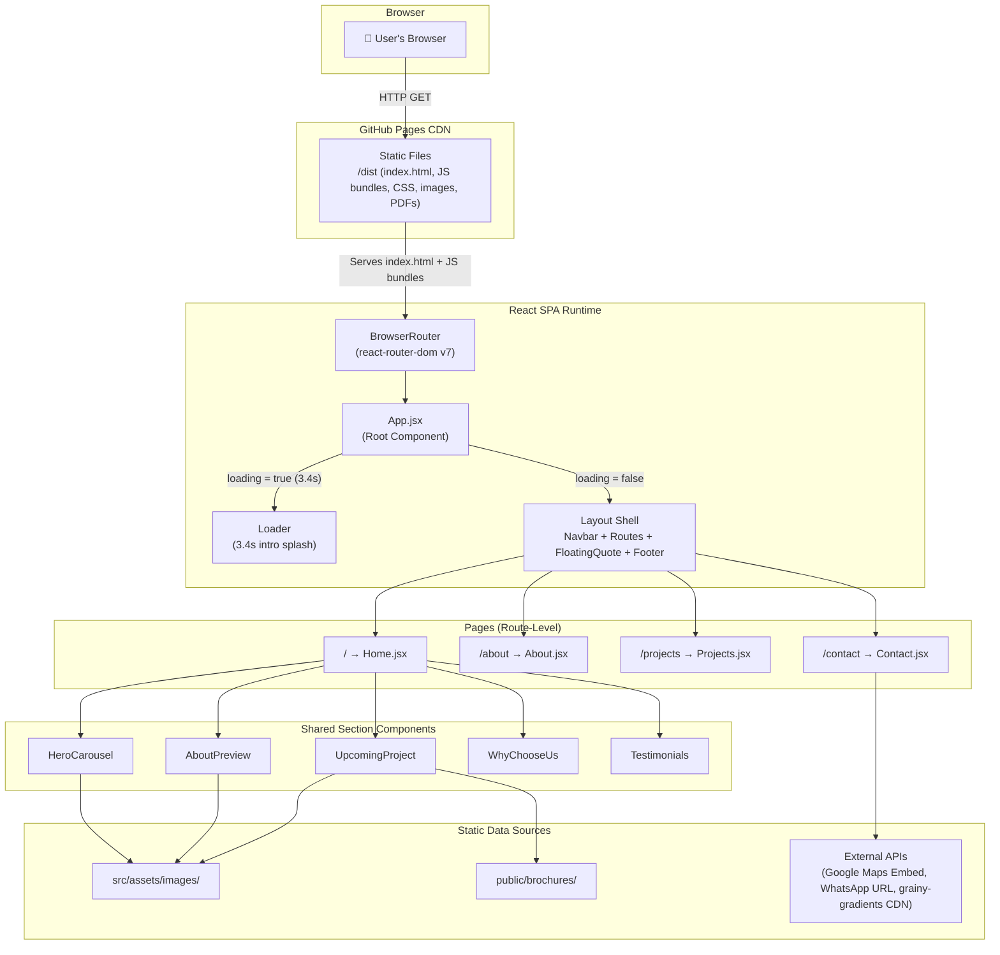

---

## 2. Application Boot Sequence

This diagram shows exactly what happens from the moment the browser loads the page to when the user sees the full site.

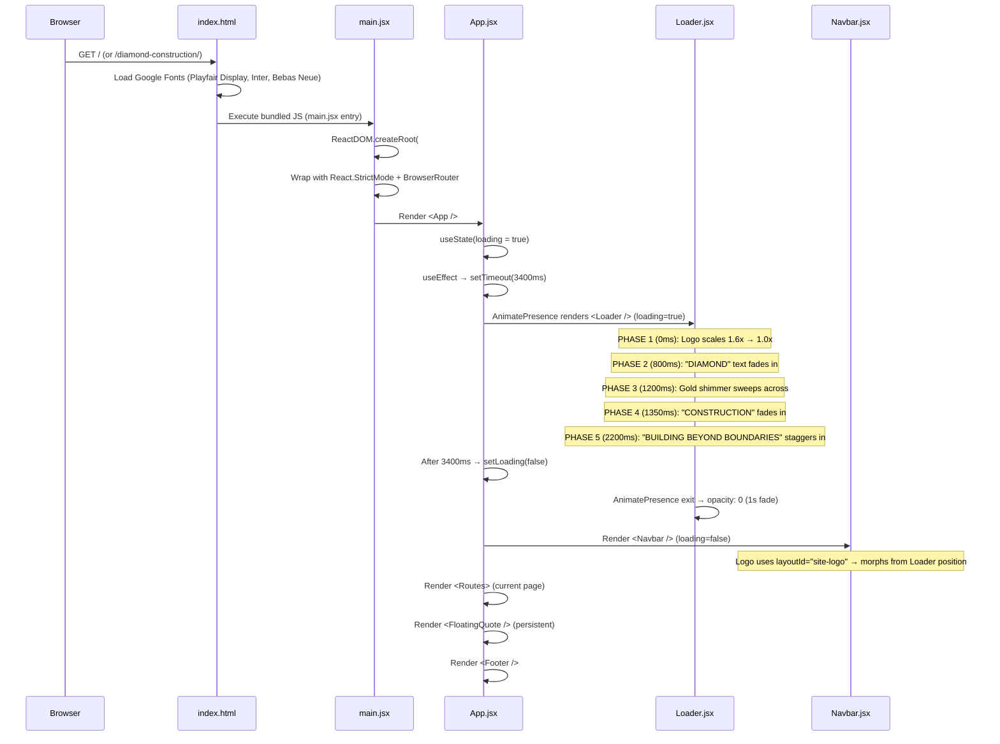

---

## 3. Routing Architecture

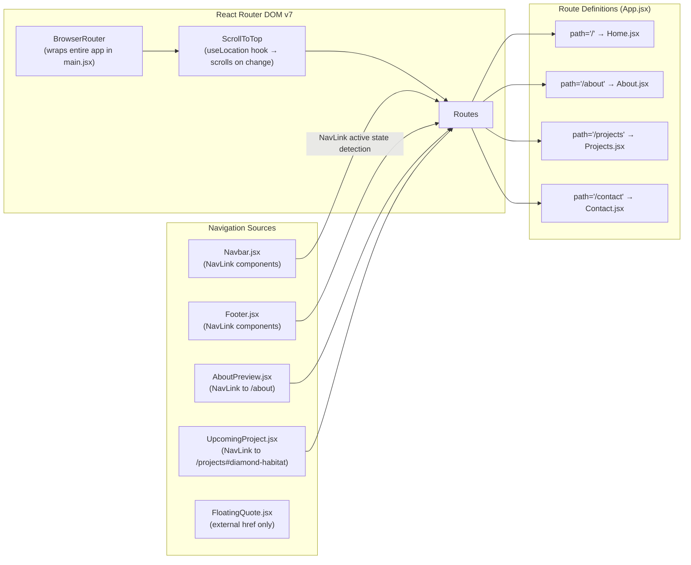

> **Note:** GitHub Pages serves only `index.html`. The Vite `base: "/diamond-construction/"` config ensures all asset URLs are prefixed correctly. All navigation is client-side — no server-side routing.

---

## 4. Component Tree

Full render tree showing parent-child relationships for every route.

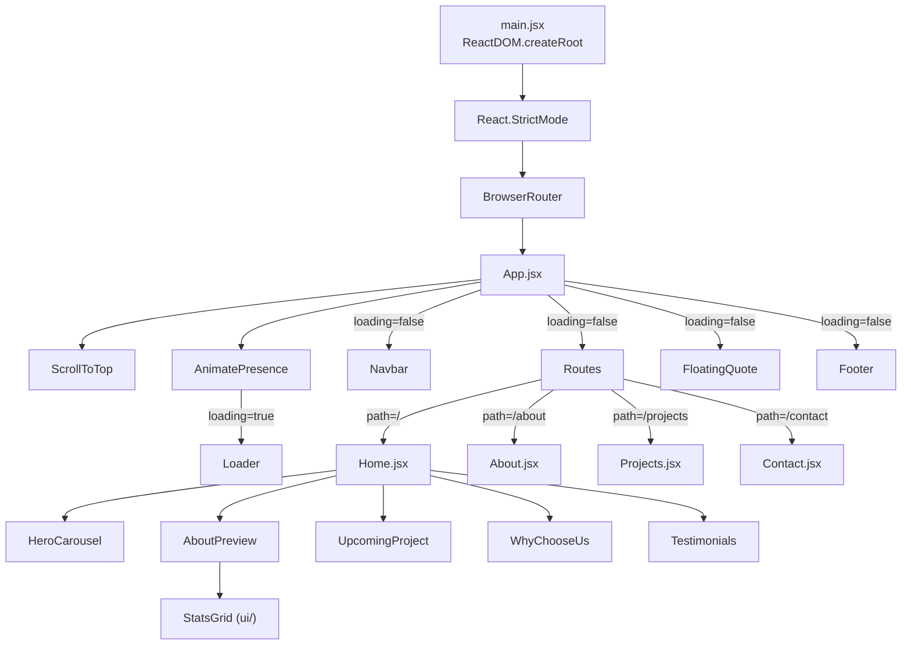

---

## 5. Home Page Section Flow

The Home page is purely a **composition layer** — it renders section components in order with visual separators.

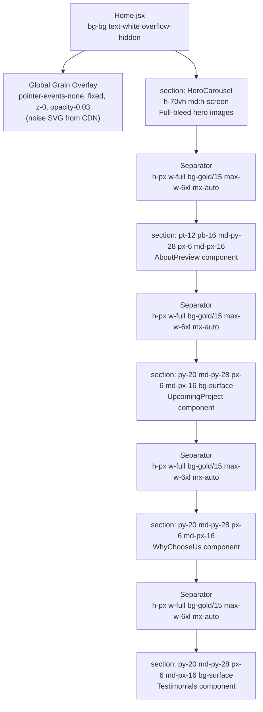

---

## 6. Loader Animation Sequence

The Loader has a carefully timed multi-phase animation sequence built with Framer Motion.

```mermaid
gantt
    title Loader Animation Timeline (ms)
    dateFormat X
    axisFormat %Lms

    section Logo
    Logo scale 1.6x → 1.0x  :0, 2400

    section Brand Name
    "DIAMOND" fade up        :800, 1900
    Gold shimmer sweep       :1200, 3000
    "CONSTRUCTION" fade in   :1350, 2350

    section Tagline
    "BUILDING" fade in       :2200, 2800
    "BEYOND" fade in         :2450, 3050
    "BOUNDARIES" fade in     :2700, 3300

    section Exit
    Loader opacity 0 (exit)  :3400, 4400
```

### Animation Detail

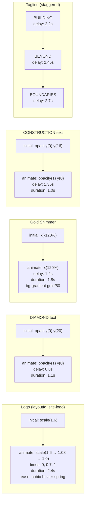

---

## 7. Navbar Smart-Hide Logic

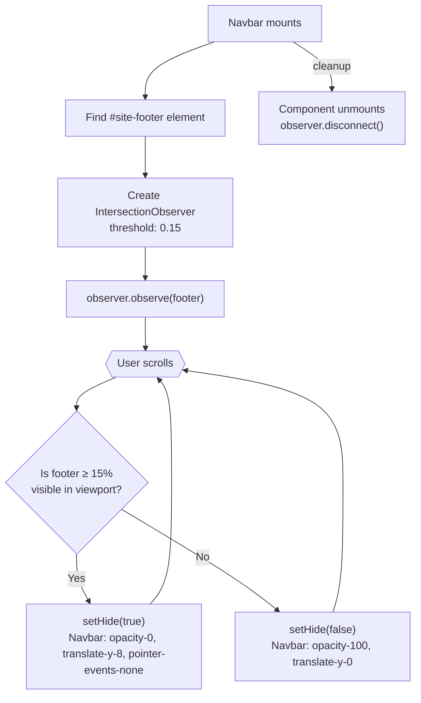

### Active Route Indicator ("Lamp")

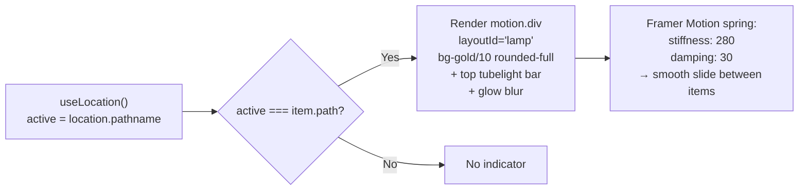

---

## 8. FloatingQuote Panel State Machine

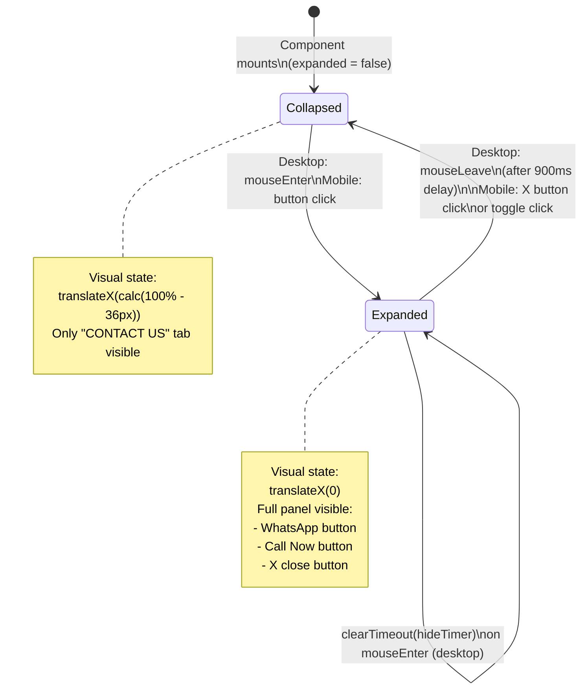

### Device Detection Logic

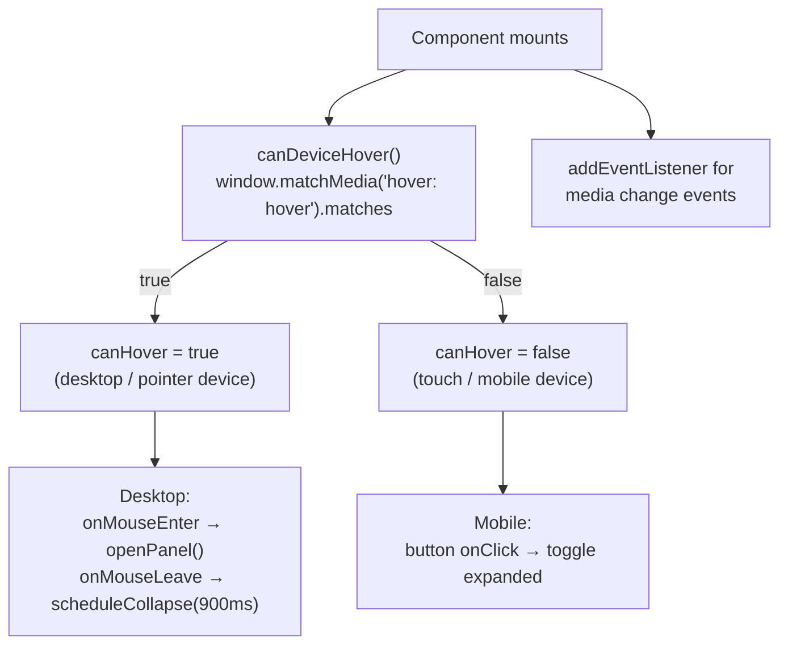

---

## 9. HeroCarousel Logic

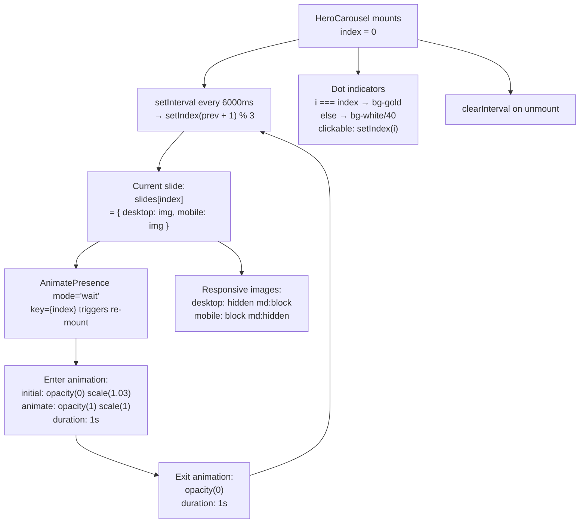

---

## 10. Testimonials Cycle Logic

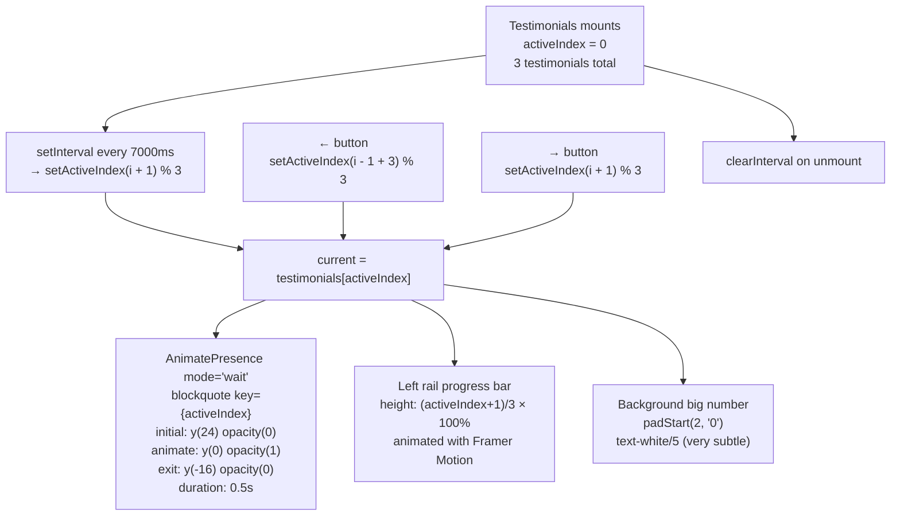

---

## 11. Data Flow — Static Props & Local Data

Since there is no backend API, all data is **co-located** inside the component files as JavaScript arrays.

```mermaid
graph LR
    subgraph "Data Sources (all static / hardcoded)"
        SLIDES_DATA["HeroCarousel.jsx\nslides[] = [\n  {desktop, mobile} × 3\n]"]
        STATS_DATA["StatsGrid.jsx\nstats[] = [\n  15+ Years,\n  10+ Milestones,\n  50000+ Sq Ft,\n  500+ Customers\n]"]
        FEATURES_DATA["WhyChooseUs.jsx\nfeatures[] = [\n  6 feature cards\n]"]
        TEST_DATA["Testimonials.jsx\ntestimonials[] = [\n  3 client reviews\n]"]
        PROJ_DATA["Projects.jsx\nprojects[] = [\n  4 projects\n]"]
        CONTACT_DATA["Contact.jsx\ninline array =\n  Phone, WhatsApp, Email\n"]
        UPCOMING_DATA["UpcomingProject.jsx\nHardcoded: Diamond Habitat\nDetails as JSX"]
    end

    subgraph "Asset Imports"
        LOGO["logo.png\n→ Navbar, Footer, Loader"]
        PROJ_IMGS["project1-4.jpeg\n→ Projects.jsx"]
        HERO_IMGS["diamond-avenue/habitat/queen .jpg\n→ HeroCarousel.jsx"]
        UPCOMING_IMG["project3.jpeg\n→ UpcomingProject.jsx"]
        PDF["/brochures/Diamond-Habitat.pdf\n→ UpcomingProject.jsx (href)"]
    end

    subgraph "External Resources"
        MAPS["Google Maps iframe\n→ Contact.jsx"]
        WA["wa.me/... links\n→ Contact, FloatingQuote, UpcomingProject"]
        GRAIN_CDN["grainy-gradients.vercel.app/noise.svg\n→ Home.jsx, Footer.jsx"]
    end

    SLIDES_DATA -->|props| HeroCarousel
    STATS_DATA -->|props| StatsGrid
    FEATURES_DATA -->|.map()| WhyChooseUs
    TEST_DATA -->|.map()| Testimonials
    PROJ_DATA -->|.map()| Projects
    CONTACT_DATA -->|.map()| Contact
    UPCOMING_DATA -->|JSX| UpcomingProject
```

---

## 12. Asset Pipeline & Build Flow

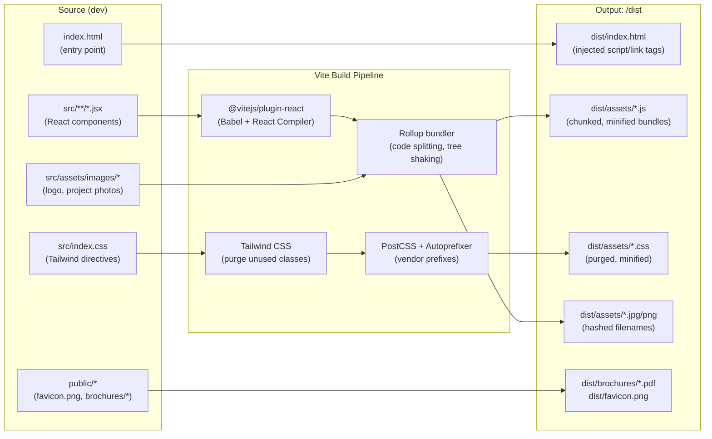

---

## 13. Deployment Pipeline (GitHub Pages)

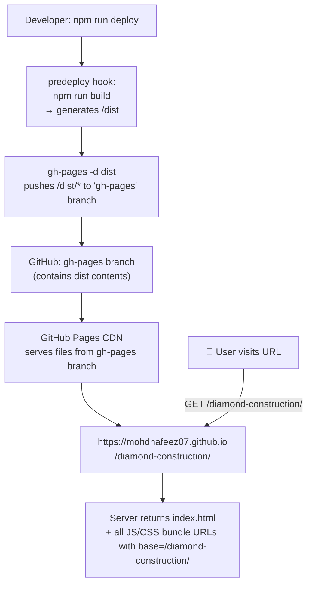

### Key Configuration Points

| File | Setting | Purpose |
|---|---|---|
| `package.json` | `"homepage": "https://mohdhafeez07.github.io/diamond-construction"` | Tells gh-pages the target URL |
| `vite.config.js` | `base: "/diamond-construction/"` | Prefixes all asset URLs in the build |
| `package.json` | `"predeploy": "npm run build"` | Auto-builds before deploying |

---

## 14. Design Token System

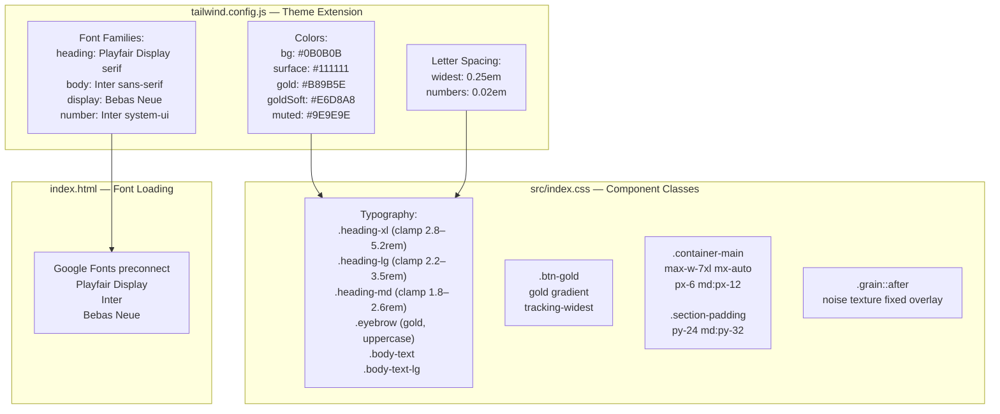

---

## 15. Animation Architecture

All animation is handled by **Framer Motion v12**. No CSS animations or transitions are used for page-level or scroll animations.

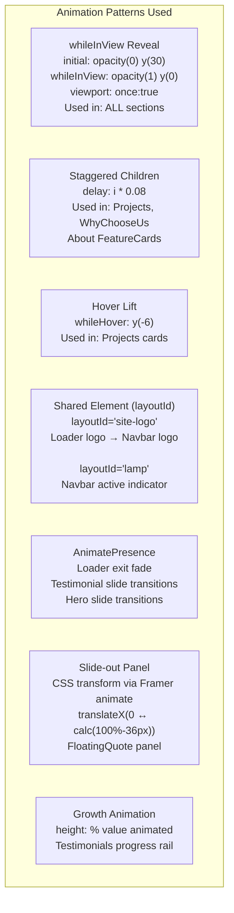

### Framer Motion Component Usage Map

| Component | Framer Features Used |
|---|---|
| `Loader.jsx` | `motion.div`, `motion.img`, `motion.span`, `AnimatePresence` (exit), `layoutId="site-logo"` |
| `Navbar.jsx` | `motion.img` (logo), `motion.div` (lamp), `layoutId="lamp"`, `layoutId="site-logo"` |
| `HeroCarousel.jsx` | `AnimatePresence mode="wait"`, `motion.div` (scale+fade transition) |
| `AboutPreview.jsx` | `motion.div` (fade-up on animate) |
| `StatsGrid.jsx` | `motion.div` (whileInView), `motion.p` (number reveal) |
| `UpcomingProject.jsx` | `motion.div` (x-axis slide-in left/right) |
| `WhyChooseUs.jsx` | `motion.div` (staggered whileInView cards) |
| `Testimonials.jsx` | `AnimatePresence mode="wait"`, `motion.blockquote`, `motion.div` (progress bar height) |
| `Footer.jsx` | `motion.div` with `variants`, custom animation delays |
| `About.jsx` | `motion.h2`, `motion.p`, `motion.div` (all whileInView) |
| `Projects.jsx` | `motion.div` (staggered whileInView + whileHover) |
| `Contact.jsx` | `motion.a`, `motion.div` (whileInView) |

---

## 16. Responsive Breakpoint Strategy

Tailwind CSS default breakpoints used throughout:

| Breakpoint | Min Width | Usage |
|---|---|---|
| *(default)* | 0px | Mobile-first base styles |
| `sm:` | 640px | 2-column layouts begin |
| `md:` | 768px | Desktop navbar, full padding, show text labels |
| `lg:` | 1024px | 3-4 column grids, 2-col content layouts |
| `max-w-6xl` | 1152px | Article/content containers |
| `max-w-7xl` | 1280px | Wide content containers |

### Key Responsive Patterns

```
Navbar:
  Mobile: icon-only (Home/User/Briefcase/Mail icons), bottom-4
  Desktop: text labels (HOME/ABOUT/PROJECTS/CONTACT), top-6

Hero:
  Mobile: h-70vh, mobile-specific images (portrait crop)
  Desktop: h-screen, landscape images

Grids:
  StatsGrid:     1 col → sm:2 col
  WhyChooseUs:   1 col → sm:2 col → lg:3 col
  Projects:      1 col → sm:2 col → lg:4 col
  About Values:  1 col → sm:2 col
  About Cards:   1 col → sm:2 col → lg:4 col

Contact:
  Cards: 1 col → sm:2 col → md:3 col
  Office+Map: 1 col → lg:2 col

Footer:
  Logo: center (mobile hidden → desktop visible at col 2)
  Grid: 1 col → md:3 col
```

---

## 17. File Dependency Graph

Which files import which — showing the full import tree.

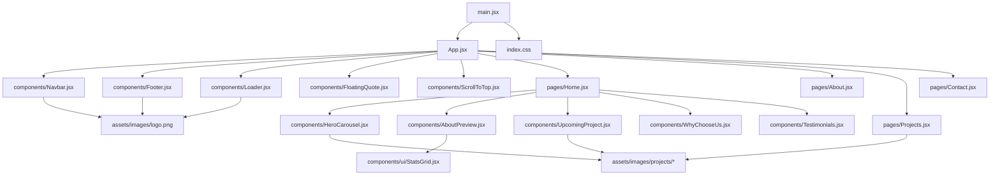

---

## Summary Comparison Table

| Concern | Solution |
|---|---|
| **Framework** | React 19 (JSX, function components, hooks) |
| **Build Tool** | Vite 7 (Rollup under hood, ESM native) |
| **Routing** | React Router DOM v7 (BrowserRouter, SPA) |
| **Animation** | Framer Motion v12 (whileInView, AnimatePresence, layoutId) |
| **Styling** | TailwindCSS v3 (utility classes + custom tokens) |
| **Icons** | Lucide React + React Icons |
| **Data** | 100% static — no API, no database, no CMS |
| **State** | Component-local useState/useEffect only — no global state manager |
| **SEO** | Meta tags in index.html; no SSR (CSR only) |
| **Deployment** | GitHub Pages via gh-pages npm package |
| **Hosting** | GitHub CDN (free static hosting) |
| **PDF** | Served from /public/brochures/ as static file |
| **Maps** | Google Maps iframe embed (no API key needed) |
| **Contact** | Direct href: tel:, mailto:, wa.me/ — no form, no server |

---

<div align="center">
  <p><em>Diamond Construction — Architecture Document</em></p>
  <p><em>Building Beyond Boundaries</em></p>
</div>
